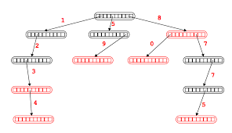

# Autocomplete feature using Trie

Try to imitate/implement the autocomplete logic behind google search bar.

## Brief Explanation
We have a Trie data structure to store some strings that the user would query
later on. 

The Trie is implemented using Node, each Node has an array of pointers to its
children Node, corresponding to 26 alphabets. To insert a string, we simple
iterate the string from the root, insert new Node pointer as saw fit, and
at the end of the string mark the node as a word.

The Trie could have an array of pointers more than 26 nodes to support additional
characters like "-", "?", " ", etc. However that come at the cost of additional memory
for each node.

We can first construct a Trie and start to accept user's query and stores them in Trie.
Or we can provide our own user query history and input them into the Trie. Either way,
the user then can provide a prefix, and with the prefix, we provide all words in Trie
containing the prefix.

## Algorithm
To search for all the possible results, we look to backtracking/dfs. However we doesn't
start backtracking at the root of the Trie. When we search for the prefix in the Trie, 
we would end in a node matching the last character of the prefix, and that's the node
we start querying. Because we don't care other subtree that doesn't contain the prefix.

We would backtrack like this: we start with the prefix as our word, as we explore each child,
we append the character corresponding to the child to our word, and search recursively. Once
we return from that call, we remove that character and explore other children nodes.
If we encounter a node that is marked by Trie as a word, we add it to the result.

When we finish searching, return the List that contains the all the search results.

## Example
Say we insert the following words into our Trie:
hello
dog
hell
cat
a
hel
help
helps
helping

And then we query for prefix "hel", this is what we would get:

## Analysis

### Time complexity
Inserting words into Trie takes O(n) for each word, whereas n = length of the longest word. 
Since we traverse the pointers in Trie with characters in the word.

To search for all possible words with the prefix, we have to consider all 26 children 
pointers at each node starting at the end, hence the runtime is O(26 ^ k), whereas k is
the length of the longest suffix with the given prefix.

### Space complexity
Trie takes up O(m * n) whereas m is the length of the longest word, n is the number of words.
Since we also use stack space when backtracking, space complexity is O(m * n + 26 ^ k).

## Optimization

If the user query data set is large enough, our search might contain too many results, we can
give each word a frequency counter and keep count of how many times user search for this word,
then when we return the search result, we could return the top 5 most frequent search word
start with the given prefix.

If the user query data set is **super** large, then we have to consider pruning the search by
adding frequency count to all the nodes, and when a search happens, we increment all the nodes
along the path. As we considered the 26 child nodes for potential search, we start search the children
that has been traverse the most to the least. If we currently have 5 words in our search results, 
when considering new children to search, we check if that path has been traversed at least as many
times as our 5th words frequency count, otherwise we know that child wouldn't give us better result.

If the user query strings are all lexicographical sparse(Not many of them sharing prefix), then maybe
we should consider using a Tenary Search Tree instead of a Trie. However if many of them might have
a common prefix, then Trie is a good choice.
